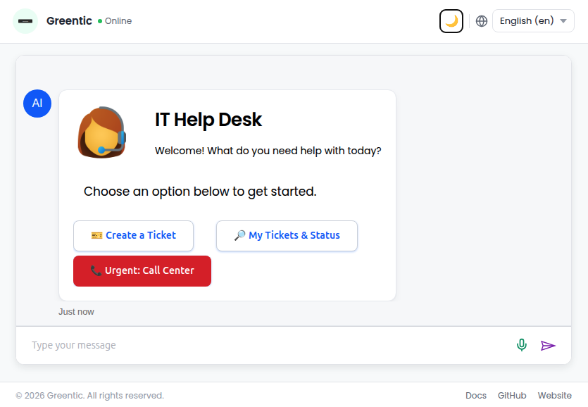
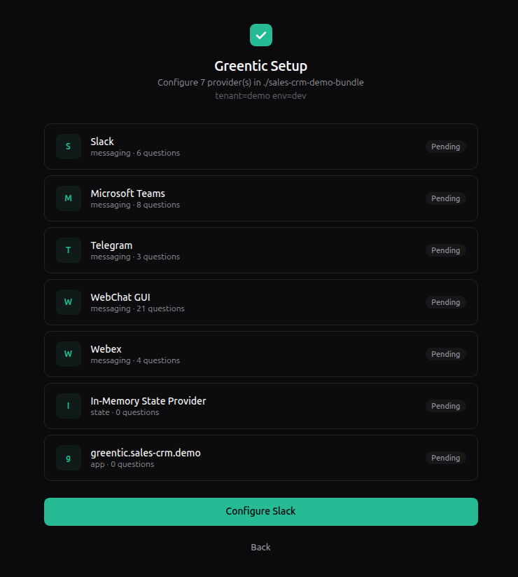
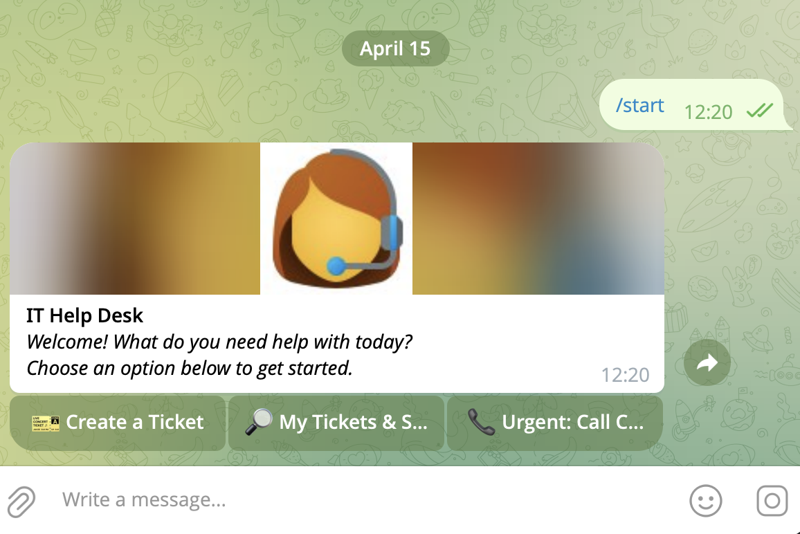

# Greentic — The Digital Workers OS

[](#license)
[](#high-level-features)
[](#why-greentic)
[](#high-level-features)

## Deterministic digital workers for real enterprise execution

Greentic is the operating system for digital workers: deterministic, governed, multi-tenant automation that can safely use AI where it adds value and stay fully controlled where it matters most.

---

# Why care?

## IT Helpdesk Digital Worker

This is the kind of result Greentic is built for: a real digital worker that can receive requests, guide a user, create tickets, check status, escalate urgent issues, and operate consistently across channels.



After installing Greentic, you only need **three steps** to get a working digital worker running.

## 1) Create a bundle

```bash
gtc wizard --answers https://github.com/greenticai/greentic-demo/releases/latest/download/helpdesk-itsm-create-answers.json
```

## 2) Setup the bundle

```bash
gtc setup ./helpdesk-itsm-demo-bundle --answers https://github.com/greenticai/greentic-demo/releases/latest/download/helpdesk-itsm-setup-answers.json
```



## 3) Start using your digital worker

```bash
gtc start ./helpdesk-itsm-demo-bundle
```

Your digital worker can then be used in:

- WebChat
- Microsoft Teams
- Slack
- Webex
- WhatsApp
- Telegram
- and more



---

# Deploy to AWS, GCP or Azure

The same pattern extends to cloud deployment.

```bash
gtc wizard --answers https://github.com/greenticai/greentic-demo/releases/latest/download/cloud-deploy-demo-create-answers.json
gtc setup --no-ui ./cloud-deploy-demo-bundle --answers https://github.com/greenticai/greentic-demo/releases/latest/download/cloud-deploy-demo-setup-answers.json
gtc start ./cloud-deploy-demo-bundle
```

Greentic is designed so the path from local proof-of-value to production deployment is short, explicit, and repeatable.


Find more demos at [greentic-demo](https://github.com/greenticai/greentic-demo)
---

# Soon: create digital workers in seconds

Greentic is evolving from powerful deterministic tooling into an even faster creation experience.

The goal is simple:

> describe the business outcome you want, and generate the starting digital worker in seconds.

Embedded demo asset included in this package:
[](https://youtu.be/js0yon1OlVU)

---

# Why Greentic?

AI demos are easy.

Production-grade AI execution is not.

Most agentic platforms make it easy to connect an LLM to tools, but much harder to guarantee what happens next. That is acceptable in experiments. It is not acceptable when workflows affect customers, employees, regulated processes, financial operations, or production systems.

A tiny hallucination rate may sound impressive in a lab. At enterprise scale, it becomes operational risk.

Greentic was built around a different idea:

> **Deterministic by default. Just enough AI to add real business value.**

That means:

- flows are explicit
- capabilities are declared upfront
- execution is bounded
- policy can be enforced
- audit can be attached
- AI is used deliberately, not casually

Greentic is not trying to create mysterious black-box automation. It is trying to make digital work executable, governable, explainable, and deployable.

---

# What is a digital worker?

A **digital worker** is a deterministic system that completes a meaningful task end to end.

It is more than a chatbot and more than a workflow script.

A digital worker can:

- receive a message, event, webhook, form, or trigger
- understand which deterministic flow should run
- execute approved components and tools
- ask humans for input when needed
- apply policies and controls
- escalate exceptions
- produce a real business outcome

In practice, a digital worker often combines:

- message or event intake
- deterministic orchestration logic
- component or tool execution
- optional AI steps for routing, interpretation, or transformation
- human checkpoints where appropriate

The more repetitive, structured, and operationally important the task, the stronger the case for a digital worker.

If a process matters, you should be able to describe how it runs, what it is allowed to do, and how it is governed. If you cannot describe that, handing it to an unbounded agent does not remove the risk. It hides it.

Greentic exists to keep the benefits of AI while preserving the discipline of engineering.

---

# High-level features

## 🧱 Component-based architecture

Greentic is built from self-describing executable units.

- WebAssembly components for lightweight, portable execution
- WASIp2 sandboxing for isolation and control
- explicit capabilities per component
- explicit lifecycle: setup, update, remove
- self-describing contracts and runtime behavior

This makes systems easier to reason about, validate, reuse, and secure.

## 🔁 Deterministic orchestration

Flows define what happens.

- graph-based execution
- explicit transitions
- session-aware and stateless patterns
- shared state support
- canonical runtime formats for speed and consistency

You do not hope the right thing happens. You define it.

## 💬 Messaging and event channels

Digital workers need to interact with people and systems where work already happens.

Greentic supports messaging and event-driven patterns across channels such as:

- Slack
- Microsoft Teams
- Webex
- WhatsApp
- Telegram
- WebChat
- Webhooks
- Email
- SMS
- Timers

Greentic also supports adaptive-card style experiences and graceful channel-specific downscaling when one channel supports richer UI than another.

## 🌍 Multi-language interaction

Digital workers need to work for humans, not force humans to work around systems.

Greentic is designed for multilingual operation and localized interaction, allowing digital workers to meet users in their own language across channels and UI surfaces.

## 🤖 AI — controlled and explicit

Greentic uses AI where it is useful, but never as an excuse to remove control.

Examples include:

- **Chat2Flow** for routing intent to the right flow
- **Chat2Data** for turning natural language into system-specific dialects with guardrails
- **Fast2Flow** for fast routing with deterministic and fallback strategies
- explicit LLM components with declared permissions

AI is not ambient. It is capability-bound and intentionally placed.

## ⚡ MCP without the usual overhead

Greentic can run MCP-style integrations without forcing everything through heavy remote patterns.

- lightweight local execution
- component-first design
- reduced transport overhead
- faster runtime behavior
- easier packaging and governance

## 🔌 Extensible by design

Greentic is designed to be extended without turning the core into a mess.

Extension packs can provide:

- secrets backends
- shared state providers
- telemetry integrations
- OAuth providers
- policy layers
- routing engines
- deployers
- compliance hooks
- analytics hooks
- and more

---

# Agentic solutions, industry solutions, and what is coming next

## Greentic-DW

Greentic-DW extends the platform toward higher-level agentic solution design while staying grounded in deterministic execution.

The point is not to make systems more chaotic. The point is to make sophisticated multi-step and multi-agent outcomes easier to design, review, and deploy safely.

## Greentic-X

Greentic-X is the path toward higher-level solution kits and domain packs that sit on top of the Greentic core.

**Industry solutions are coming soon.**

The long-term direction is to make it easier to compose industry-specific digital workers without abandoning the core principles of explicit execution, governance, and reusability.

## Coming soon: System of Record Language

System of Record Language is the direction for describing business structures, systems, and operational semantics at a higher level so they can be connected more naturally to digital workers.

The vision is straightforward:

- describe the business reality once
- map it to deterministic execution
- let digital workers operate against that model safely and consistently

---

# Capabilities, control, and observer

These are some of the most important ideas in Greentic.

## Capabilities

Capabilities define what a component or part of the system is allowed to do.

This avoids ambient authority and makes execution explicit. Instead of a component quietly having broad access to everything, capabilities make permissions visible and enforceable.

That matters for security, but also for architecture. Systems become easier to reason about when each unit can only do what it was explicitly granted to do.

## Control

Control layers allow policy and routing logic to shape execution.

They can be used to:

- deny unsafe or non-compliant actions
- route requests based on policy or context
- enforce region, tenant, or team-specific behavior
- inject governance before work proceeds
- implement decisioning that is explicit and auditable

This is how you move from “the workflow ran” to “the workflow ran under policy.”

## Observer

Observer layers allow you to attach audit, analytics, monitoring, and compliance visibility around execution.

They can be used to:

- produce audit trails
- monitor execution behavior
- export telemetry
- track policy decisions
- support governance and compliance reviews
- measure operational effectiveness

This is how digital workers become acceptable in serious enterprise environments. They do not just execute. They execute with oversight.

---

# The gtc wizard model

Greentic favors structured, reproducible creation over hidden configuration.

The `gtc wizard` flow is central to that experience.

## Inspect the schema

```bash
gtc wizard --schema
```

This lets you inspect the questions and structure used to create artifacts.

## Create from answers

```bash
gtc wizard --answers <answers.json>
```

This lets you generate repeatable outputs from an explicit answer set.

That matters because:

- environments become reproducible
- setup becomes reviewable
- automation becomes easier
- CI/CD becomes cleaner
- generated bundles can be recreated deterministically

The same philosophy carries into setup:

```bash
gtc setup ./some-bundle --answers <setup-answers.json>
```

Greentic is opinionated about making the path from intent to runnable system explicit.

---

# Installation

Install Greentic via `cargo-binstall`.

```bash
cargo binstall gtc
gtc install
```

If you prefer installing from source:

```bash
git clone https://github.com/greenticai/greentic.git
cd greentic/greentic
cargo install --path . --locked
gtc install
```

## Install modes

```bash
# Public tools only
gtc install

---

# Prerequisites

Install Rust 1.91 or newer, add the WASIp2 target, and install `cargo-binstall`.

```bash
curl --proto '=https' --tlsv1.2 -sSf https://sh.rustup.rs | sh
rustup toolchain install 1.91.0
rustup target add wasm32-wasip2
cargo install cargo-binstall
```

Confirm installation:

```bash
cargo --version
```

## Windows notes

- Install Rust first from the official Rust installer page.
- Run `rustup-init.exe`.
- Open a fresh terminal afterwards so `cargo` is on `PATH`.
- When Windows shows a security popup during `cargo binstall gtc`, confirm it.
- If that popup is dismissed, rerun the command and allow it before running `gtc install`.

---


# Architecture overview

Greentic builds digital workers in layers:

```text
Component → Flow → Pack → Bundle → Operator
```

## Component

- WASM module
- self-describing contract
- explicit capabilities
- deterministic lifecycle

## Flow

- graph of nodes
- YAML authoring to production artifact path
- explicit transitions

## Pack

- distribution unit
- components plus flows
- versioned and validated
- doctor and validation workflows

## Bundle

- defines deployed packs
- configures tenant and team access
- enables extensions and providers

## Operator

- setup phase
- start phase
- capability enforcement
- controlled runtime boundary
- warmup and execution lifecycle

---

# Messaging vs events

## Messaging

Best for interactive and session-based workflows.

- multi-step conversations
- adaptive card support
- channel translation and downscaling
- stateful user journeys

## Events

Best for stateless and trigger-driven workflows.

- webhooks
- timers
- SMS
- email
- fire-and-forget processing

Greentic supports both because real business work spans both.

---

# Deterministic model

Greentic avoids the common failure modes of uncontrolled agent systems.

It avoids:

- unbounded autonomous execution
- hidden permissions
- undefined tool-calling behavior
- ambient authority
- unclear operational accountability

Instead, Greentic favors:

- explicit flows
- bounded execution
- declared capabilities
- versioned configuration
- reproducible setup and deployment

That is what makes it enterprise-ready by design.

---

# Multi-tenancy

Greentic is designed for real organizational structure.

Hierarchy:

- Global
- Tenant
- Team
- User

The operator denies by default. Access must be explicitly granted.

This matters for isolation, governance, and safe shared infrastructure.

---

# Performance model

Greentic is engineered for lightweight execution.

- small runtime artifacts
- fast startup and warmup characteristics
- reduced transport overhead
- local component execution patterns
- deterministic payload passing

The aim is not to be flashy. It is to be fast enough, small enough, and controlled enough to be practical everywhere.

---

# Positioning snapshot

This comparison is intended as a high-level product positioning view, not a protocol shootout.

Legend: `✅` = strong / first-class, `⚠️` = present but partial or stack-dependent, `❌` = not a core strength, `🚧` = emerging in Greentic.

| Capability | Greentic | Microsoft Foundry agent stack | OpenAI agent stack | Google Vertex AI agent stack | LangGraph / LangChain | CrewAI | AutoGen |
|---|---|---|---|---|---|---|---|
| Deterministic execution first | ✅ | ⚠️ | ⚠️ | ⚠️ | ⚠️ | ⚠️ | ⚠️ |
| Agentic / multi-agent support | ✅ | ✅ | ✅ | ✅ | ✅ | ✅ | ✅ |
| Human-in-the-loop workflow patterns | ✅ | ✅ | ✅ | ⚠️ | ✅ | ✅ | ✅ |
| Enterprise identity / network controls | ✅ | ✅ | ⚠️ | ✅ | ❌ | ⚠️ | ❌ |
| Managed runtime / hosted production surface | ✅ | ✅ | ⚠️ | ✅ | ❌ | ⚠️ | ❌ |
| Built-in tracing / observability | ✅ | ✅ | ✅ | ✅ | ⚠️ | ✅ | ⚠️ |
| Prompt designer | 🚧 | ⚠️ | ✅ | ✅ | ⚠️ | ❌ | ❌ |
| Store | 🚧 | ✅ | ❌ | ✅ | ❌ | ❌ | ❌ |
| Multi-tenant orientation | ✅ | ⚠️ | ⚠️ | ⚠️ | ❌ | ⚠️ | ❌ |
| Lightweight runtime artifacts | ✅ | ❌ | ❌ | ❌ | ❌ | ❌ | ❌ |

Greentic is not trying to out-demo everyone. It is trying to give enterprises a cleaner foundation for controlled digital work.

---

# Repository structure

- `greentic-interfaces` — shared WASM interfaces
- `greentic-types` — shared structures and schemas
- `greentic-component` — component tooling and lifecycle
- `greentic-flow` — flow tooling and orchestration assets
- `greentic-pack` — pack creation and validation
- `greentic-operator` — bundle execution runtime
- `greentic-dev` — developer-facing tools
- `greentic-mcp` — MCP-related tooling and runtime patterns
- `greentic-messaging-providers` — Teams, Slack, Webex, and more
- `greentic-events-providers` — webhook, timer, SMS, email, and more
- extension repos for OAuth, state, session, telemetry, and related concerns
- `component-*` — open source reusable components

---

# Sponsors

- [Greentic AI Ltd](https://greentic.ai) — the company behind Greentic
- [3Point.ai](https://3point.ai) with 3AIgent powered by Greentic — get AI ROI quickly
- [DataArt](https://dataart.com) — core contributors and certified technical consultants
- [Become a sponsor](mailto:sponsor@greentic.ai)

---

# Contributing

Greentic is built for people who care about serious production systems, reusable platform design, and controlled AI execution.

## Basic flow

1. Fork the repository
2. Create a feature branch
3. Add or update tests
4. Run formatting and linting
5. Open a pull request

## Please include

- design explanation
- migration notes when applicable
- test coverage for behavior changes

Contributions that improve clarity, determinism, security, tooling, and reuse are especially valuable.

---

# Governance and versioning

Greentic emphasizes explicit evolution over silent drift.

- semantic versioning
- stable component contracts
- controlled migration paths
- explicit deprecations

The goal is to make upgrades manageable and system behavior understandable over time.

---

# Security

Security is not an afterthought in Greentic. It is a design principle.

Greentic enforces:

- capability-based execution
- WASIp2 sandboxing
- no ambient authority
- tenant-aware isolation
- explicit runtime boundaries

## Why control and observer matter for security

Traditional automation often focuses only on whether something can run.

Greentic also focuses on:

- whether it should run
- under which policy it can run
- what should be observed when it runs
- what evidence should exist afterwards

That makes control and observer valuable not only for platform design, but for compliance, governance, and trust.

Control can stop or shape unsafe execution.
Observer can create the auditability required for regulated or sensitive workflows.

Together, they help move digital workers from experimentation into enterprise-grade operations.

Report vulnerabilities responsibly according to the project security process.

---

# Maintainers

Greentic is maintained by the Greentic core team and contributors.

Community governance will continue to mature as the ecosystem grows.

---

# License

See `LICENSE` for details.

---

# Final perspective

Greentic is not a toy workflow builder.

It is not a prompt wrapper.

It is not an uncontrolled agent runtime.

## It is the operating system for digital work.

If you want AI without giving up control, if you want automation without losing auditability, and if you want digital workers that can actually be deployed across serious organizations, Greentic is the foundation.

**Build digital workers. Run them under policy. Scale them with confidence.**

Visit [Greentic.ai](https://greentic.ai)
